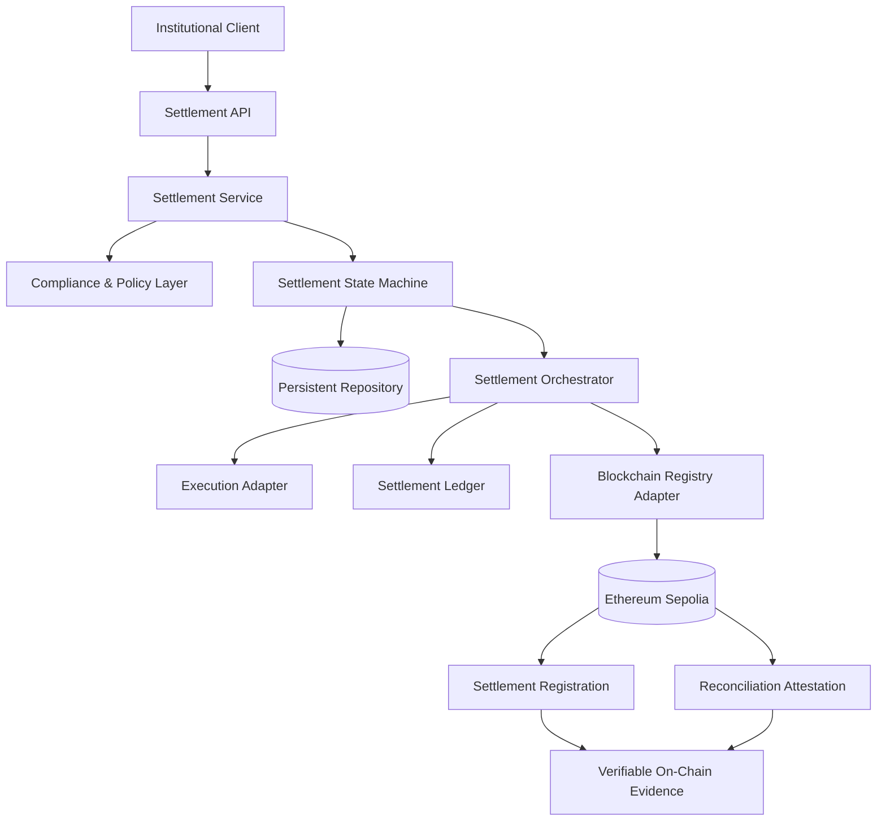

# Seenovar Stablecoin Settlement

### Compliance-Aware Settlement Orchestration & On-Chain Reconciliation

Reference architecture for institutional stablecoin settlement, combining deterministic lifecycle management, compliance gating, idempotent processing, persistent state, execution orchestration, and verifiable Ethereum reconciliation.

Built with **TypeScript, Fastify, Solidity, ethers.js, SQLite, Hardhat, and Vitest**, with a verified Ethereum Sepolia deployment and end-to-end on-chain settlement evidence.

---

## Engineering Highlights

- **74 automated tests** across backend, integration, and smart contract layers
- **Verified Solidity contract** deployed on Ethereum Sepolia
- **End-to-end on-chain registration and reconciliation**
- Explicit settlement lifecycle and state-transition enforcement
- Compliance and policy gating before execution
- Idempotent settlement processing
- Persistent settlement state backed by SQLite
- Execution abstraction decoupled from settlement-domain logic
- Dedicated blockchain registry adapter
- Minimal on-chain data footprint
- Verifiable reconciliation trail
- Strict API schema validation
- Failure-state handling across the execution lifecycle

---

## Architecture

```




### Architectural Boundary

Settlement-domain state and institutional metadata remain authoritative in the application layer.

Ethereum is used as an independent attestation and reconciliation layer rather than as the system of record for complete institutional settlement data.

This separation limits unnecessary on-chain exposure while preserving independently verifiable evidence of settlement registration and reconciliation.
```

### Architectural Boundary

Settlement-domain state and institutional metadata remain authoritative in the application layer.

Ethereum is used as an independent attestation and reconciliation layer rather than as the system of record for complete institutional settlement data.

This separation limits unnecessary on-chain exposure while preserving independently verifiable evidence of settlement registration and reconciliation.

---

## Settlement Lifecycle

```text
CREATED
   │
   ▼
COMPLIANCE_PENDING
   │
   ▼
APPROVED
   │
   ▼
SUBMITTED
   │
   ▼
CONFIRMED
   │
   ├──► Settlement Ledger
   │
   ├──► On-Chain Registration
   │
   └──► On-Chain Reconciliation
              │
              ▼
         RECONCILED

Execution failure
       │
       ▼
     FAILED
```

The state machine prevents invalid lifecycle progression and ensures that execution cannot occur before compliance approval.

---

## Live Network Evidence

The settlement registry is deployed and source-verified on **Ethereum Sepolia**.

### Verified Settlement Registry

**Contract**

`SeenovarSettlementRegistry`

**Address**

```text
0x5325C1c22C386F79CE0F036d561c6568B59E6Ed3
```

**Verified source**

https://sepolia.etherscan.io/address/0x5325C1c22C386F79CE0F036d561c6568B59E6Ed3#code

---

### Settlement Registration

A settlement was registered through the application against the deployed registry.

**Operation**

```text
registerSettlement()
```

**Transaction**

```text
0xcc9e1b0ffac8f3a460cd9a1026e63895082a7f6b17d09b82644ab613099e4c84
```

**Block**

```text
11495668
```

**Etherscan**

https://sepolia.etherscan.io/tx/0xcc9e1b0ffac8f3a460cd9a1026e63895082a7f6b17d09b82644ab613099e4c84

---

### Reconciliation Attestation

The same settlement was subsequently marked as reconciled on-chain.

**Operation**

```text
markReconciled()
```

**Transaction**

```text
0x80adfc468462c6285c50c9b449c8faacbf09602863a5656a13eb49d1ad595d84
```

**Block**

```text
11495670
```

**Etherscan**

https://sepolia.etherscan.io/tx/0x80adfc468462c6285c50c9b449c8faacbf09602863a5656a13eb49d1ad595d84

---

### Cross-Layer Settlement Identity

Both blockchain operations reference the same deterministic settlement identifier hash:

```text
0x4faf84b7c5c974efcef9b0e0f0b4ccb3406207a4df16c8faeb69ccd71b1d4756
```

This establishes a verifiable relationship between the application settlement lifecycle and its corresponding blockchain attestations without requiring the complete settlement record to be published on-chain.

---

## Core Engineering Decisions

### 1. Off-Chain State, On-Chain Attestation

The complete settlement workflow is maintained in the application layer.

The blockchain registry is deliberately narrow in scope: it provides independently verifiable registration and reconciliation evidence without making Ethereum responsible for the full institutional workflow.

This separates operational settlement concerns from blockchain attestation.

### 2. Deterministic Lifecycle Enforcement

Settlement progression is controlled through explicit state transitions.

An execution request is rejected unless the settlement has reached `APPROVED`, and invalid lifecycle transitions are prevented by the settlement engine.

This creates a predictable domain boundary around execution.

### 3. Compliance Before Execution

Compliance evaluation is separated from transaction execution.

Settlement instructions move through `COMPLIANCE_PENDING` before becoming executable, allowing policy decisions to be enforced before funds would enter the execution layer.

The current policy engine supports jurisdiction controls and automatic amount thresholds while remaining isolated from execution infrastructure.

### 4. Idempotency at the Settlement Boundary

Settlement creation uses idempotency keys to protect the system against duplicate processing.

This is particularly important for financial workflows where retries, network failures, and repeated client requests must not result in duplicate settlement instructions.

### 5. Execution Abstraction

Stablecoin execution is isolated behind an executor interface.

The current implementation uses a simulated EVM executor, allowing settlement orchestration to be exercised deterministically without coupling the domain model to a specific custody provider, wallet infrastructure, or transaction-signing implementation.

The execution adapter can therefore be replaced independently by production transaction infrastructure.

### 6. Minimal On-Chain Footprint

Institutional metadata is not used as the primary blockchain settlement identifier.

Instead, the registry operates on a deterministic settlement hash, reducing unnecessary disclosure while preserving verifiability.

### 7. Independent Persistence Boundary

Settlement persistence is abstracted through a repository layer.

The current implementation uses SQLite, while the domain and orchestration layers remain separated from the underlying persistence technology.

---

## System Components

### Settlement API

Fastify provides the HTTP boundary for settlement creation, retrieval, execution, ledger access, and service health.

Strict request schemas reject malformed or unexpected input before it reaches the settlement domain.

### Compliance Engine

Evaluates settlement instructions against configured policy controls before execution eligibility is granted.

Current controls include:

- blocked-jurisdiction screening
- automatic settlement amount thresholds
- explicit compliance-state progression

The boundary allows external AML, sanctions, KYC/KYB, transaction-monitoring, or policy systems to be integrated independently.

### Settlement Engine

Owns settlement lifecycle state and transition rules.

It prevents invalid state progression and provides the authoritative application-level representation of settlement status.

### Settlement Repository

Provides persistent settlement storage independently of the domain layer.

SQLite is used as the current persistence implementation.

### Settlement Orchestrator

Coordinates the execution path across:

```text
Settlement Engine
      │
      ▼
Execution Adapter
      │
      ▼
Settlement Ledger
      │
      ▼
Blockchain Registry
      │
      ▼
Reconciliation
```

It also handles execution failures and transitions unsuccessful settlements into the appropriate failure state.

### Execution Adapter

Abstracts stablecoin execution from settlement orchestration.

This prevents transaction-provider-specific implementation details from leaking into settlement-domain logic.

### Settlement Ledger

Records confirmed settlement execution information and associated transaction references.

### Blockchain Registry Client

Provides the application-to-Ethereum integration boundary.

It submits settlement registration and reconciliation operations to the deployed `SeenovarSettlementRegistry` contract and returns transaction evidence including transaction hashes and block numbers.

### SeenovarSettlementRegistry

The Solidity registry provides the on-chain attestation layer.

It enforces registration and reconciliation constraints while maintaining a deliberately minimal storage model.

---

## API Surface

### Health

```http
GET /health
```

Example:

```json
{
  "status": "ok",
  "service": "seenovar-stablecoin-settlement",
  "version": "1.0.0",
  "registryEnabled": true
}
```

### Create Settlement

```http
POST /settlements
```

Creates a settlement instruction and evaluates it against configured compliance policy.

### Retrieve Settlement

```http
GET /settlements/:id
```

Returns the current persistent settlement state.

### Execute Settlement

```http
POST /settlements/:id/execute
```

Executes an approved settlement through the orchestration layer.

When the registry integration is enabled, the execution path includes blockchain registration and reconciliation.

### Retrieve Ledger Entry

```http
GET /settlements/:id/ledger
```

Returns the settlement ledger record associated with the specified settlement.

---

## Verified End-to-End Execution

A Sepolia-enabled settlement execution produced the following result:

```text
Settlement
────────────────────────────────────────────────────────

Status
RECONCILED

Settlement ID
c2fcce7e-86df-4f32-b562-c4a17afc9491

Settlement ID Hash
0x4faf84b7c5c974efcef9b0e0f0b4ccb3406207a4df16c8faeb69ccd71b1d4756


Registry Registration
────────────────────────────────────────────────────────

Transaction
0xcc9e1b0ffac8f3a460cd9a1026e63895082a7f6b17d09b82644ab613099e4c84

Block
11495668


Registry Reconciliation
────────────────────────────────────────────────────────

Transaction
0x80adfc468462c6285c50c9b449c8faacbf09602863a5656a13eb49d1ad595d84

Block
11495670
```

The final application state was:

```text
RECONCILED
```

---

## Testing & Verification

The system is covered across application, integration, persistence, orchestration, API, blockchain-client, and smart-contract boundaries.

### TypeScript / Backend

```text
12 test files passed
66 tests passed
```

### Solidity / Hardhat

```text
8 tests passed
```

### Total

```text
74 automated tests passed
```

Coverage includes:

- settlement creation
- settlement lifecycle transitions
- compliance decisions
- invalid transition rejection
- idempotency behavior
- API request validation
- API execution routes
- persistence
- ledger behavior
- successful orchestration
- failed execution handling
- blockchain registry client behavior
- owner authorization
- duplicate on-chain registration
- invalid settlement identifiers
- reconciliation of unknown settlements
- double-reconciliation protection

Run the application tests:

```bash
npm test
```

Run static TypeScript validation:

```bash
npx tsc --noEmit
```

Run the Solidity registry tests:

```bash
npx hardhat test testcontract/SeenovarSettlementRegistry.test.ts
```

---

## Smart Contract Controls

`SeenovarSettlementRegistry` enforces a constrained registry lifecycle.

The contract test suite verifies that:

- authorized registration succeeds
- non-owner registration is rejected
- duplicate settlement registration is rejected
- invalid settlement identifiers are rejected
- registered settlements can be reconciled
- reconciliation of unknown settlements is rejected
- repeated reconciliation is rejected

The deployed source code is publicly verifiable through Etherscan.

---

## Technology Stack

| Layer | Technology |
|---|---|
| Runtime | Node.js |
| Language | TypeScript |
| API | Fastify |
| Persistence | SQLite |
| Application Testing | Vitest |
| Smart Contracts | Solidity 0.8.24 |
| Blockchain Tooling | Hardhat |
| Ethereum Client | ethers.js |
| Contract Types | TypeChain |
| Network | Ethereum Sepolia |

---

## Repository Structure

```text
seenovar-stablecoin-settlement/
│
├── contracts/
│   └── SeenovarSettlementRegistry.sol
│
├── scripts/
│   └── deploy-registry.ts
│
├── src/
│   ├── blockchain/
│   │   └── settlement-registry-client.ts
│   │
│   ├── repositories/
│   │   └── sqlite-settlement-repository.ts
│   │
│   ├── routes/
│   │   └── settlements.ts
│   │
│   ├── app.ts
│   ├── compliance.ts
│   ├── execution.ts
│   ├── ledger.ts
│   ├── server.ts
│   ├── settlement-engine.ts
│   ├── settlement-orchestrator.ts
│   ├── settlement-service.ts
│   ├── settlement-state.ts
│   └── types.ts
│
├── test/
│   └── application and integration tests
│
├── testcontract/
│   └── SeenovarSettlementRegistry.test.ts
│
├── hardhat.config.ts
├── vitest.config.ts
├── tsconfig.json
└── package.json
```

---

## Local Execution

Install dependencies:

```bash
npm install
```

Create the local environment configuration:

```bash
cp .env.example .env
```

Configure the required Sepolia environment variables:

```env
SEPOLIA_RPC_URL=your_sepolia_rpc_url
PRIVATE_KEY=your_testnet_private_key
SEENOVAR_REGISTRY_ADDRESS=0xYourRegistryContractAddress
ETHERSCAN_API_KEY=your_etherscan_api_key
```

Start the API:

```bash
npm run dev
```

Default endpoint:

```text
http://127.0.0.1:3000
```

---

## Security Model

Secrets and runtime state are deliberately excluded from source control.

The repository `.gitignore` excludes:

```text
.env
*.db
*.db-shm
*.db-wal
node_modules/
artifacts/
cache/
logs/
```

Private keys and RPC credentials are injected through environment variables rather than source code.

The current deployment targets the Ethereum Sepolia test network and should not be configured with wallets containing production assets.

---

## Extension Boundaries

The architecture keeps infrastructure-specific concerns behind explicit interfaces, allowing individual components to evolve independently.

Natural extension points include:

- institutional custody and wallet infrastructure
- HSM/KMS-backed transaction signing
- regulated stablecoin execution
- external sanctions and AML services
- KYC/KYB policy providers
- enterprise relational persistence
- asynchronous settlement queues
- event-driven reconciliation
- multi-chain execution adapters
- observability and operational telemetry
- role-based operational controls

These integrations can be introduced without moving transaction-provider concerns into the core settlement-domain model.

---

## Network References

**Verified Contract**

https://sepolia.etherscan.io/address/0x5325C1c22C386F79CE0F036d561c6568B59E6Ed3#code

**Settlement Registration**

https://sepolia.etherscan.io/tx/0xcc9e1b0ffac8f3a460cd9a1026e63895082a7f6b17d09b82644ab613099e4c84

**Reconciliation Attestation**

https://sepolia.etherscan.io/tx/0x80adfc468462c6285c50c9b449c8faacbf09602863a5656a13eb49d1ad595d84
